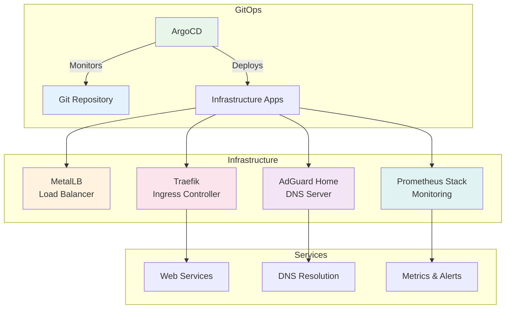

# Homelab Infrastructure

A GitOps-based Kubernetes homelab infrastructure using ArgoCD, featuring networking, monitoring, and DNS management.

## 🏗️ Architecture



## 📁 Repository Structure

```
homelab2/
├── gitops/                      # ArgoCD Application definitions
│   ├── bootstrap/              # Bootstrap applications
│   │   └── infrastructure.yaml # App-of-apps for infrastructure
│   └── infrastructure/         # Infrastructure applications
│       ├── metallb.yaml       
│       ├── traefik.yaml       
│       ├── adguard.yaml       
│       └── monitoring.yaml    
│
├── infrastructure/             # Actual infrastructure code
│   ├── bootstrap/             # ArgoCD bootstrap
│   ├── networking/           # Network components
│   │   ├── metallb/         
│   │   ├── traefik/         
│   │   └── adguard/         
│   ├── monitoring/          # Observability
│   └── docs/               # Documentation
│
└── README_STRUCTURE.md     # Detailed structure guide
```

## 🚀 Quick Start

### Prerequisites

- RKE2 or K3s cluster (see [RKE2 Setup Guide](docs/RKE2_SETUP.md))
- kubectl configured
- Helm 3.x installed
- 30GB+ available storage

### Installation

```bash
# 1. Clone repository
git clone https://github.com/sprevacomm/homelab2.git
cd homelab2

# 2. Run prerequisites
cd infrastructure/docs
./prerequisites.sh

# 3. Bootstrap ArgoCD
cd ../bootstrap
./bootstrap.sh

# 4. Deploy infrastructure
kubectl apply -f ../../gitops/bootstrap/infrastructure.yaml

# 5. Watch deployment
watch kubectl get applications -n argocd
```

## 🔧 Components

### Networking
- **MetalLB** (v0.15.2) - Bare metal load balancer
- **Traefik** (v36.3.0) - Ingress controller with Let's Encrypt
- **AdGuard Home** (v0.107.52) - DNS server with ad blocking

### Monitoring
- **Prometheus** - Metrics collection
- **Grafana** - Visualization
- **Alertmanager** - Alert management

### GitOps
- **ArgoCD** (v8.1.3) - Continuous delivery

## 🌐 Access Points

After DNS configuration:
- ArgoCD: `https://argocd.yourdomain.com`
- Traefik: `https://traefik.yourdomain.com`
- Grafana: `https://grafana.yourdomain.com`
- Prometheus: `https://prometheus.yourdomain.com`
- AdGuard: `https://adguard.yourdomain.com`

## 📚 Documentation

### Setup Guides
- [RKE2 Setup](docs/RKE2_SETUP.md) - Proxmox RKE2 cluster setup
- [SSH Setup](docs/SSH_SETUP.md) - SSH key configuration and management
- [Installation Sequence](infrastructure/docs/INSTALLATION_SEQUENCE.md) - Detailed setup guide
- [Add Worker Nodes](docs/ADD_WORKER_NODES.md) - Scale your cluster
- [Improvements Roadmap](docs/IMPROVEMENTS_ROADMAP.md) - Security & reliability enhancements

### Reference
- [Scripts Documentation](docs/SCRIPTS.md) - All available scripts
- [Structure Guide](README_STRUCTURE.md) - Repository organization
- [Troubleshooting](infrastructure/docs/TROUBLESHOOTING.md) - Common issues
- [Local Access](infrastructure/docs/LOCAL_ACCESS.md) - Access without public DNS
- [Multi-Environment](infrastructure/docs/ENVIRONMENTS.md) - Dev/staging/prod setup

## 🔐 Default Credentials

⚠️ **Change these immediately after installation!**

- ArgoCD: `admin` / `admin`
- Grafana: `admin` / `admin`
- Prometheus: `admin` / `admin`
- AdGuard: `admin` / `admin`

## 🎯 Key Features

- **GitOps Pattern** - All changes through Git
- **Automated SSL** - Let's Encrypt certificates
- **Service Discovery** - Automatic monitoring
- **Local DNS** - No external dependencies
- **High Availability** - Resilient architecture

## 🛠️ Customization

1. **Update domain**: Replace `susdomain.name` with your domain
2. **Configure IPs**: Update MetalLB range in `infrastructure/networking/metallb/manifests/base/ipaddresspool.yaml`
3. **Set email**: Update Let's Encrypt email in Traefik values
4. **Adjust resources**: Modify resource limits as needed

## 📊 Monitoring

Import these Grafana dashboards:
- `1860` - Node Exporter Full
- `7249` - Kubernetes Cluster Overview
- `17346` - Traefik 3.0+
- `14584` - ArgoCD

## 🤝 Contributing

1. Fork the repository
2. Create feature branch
3. Commit changes
4. Push to branch
5. Create Pull Request

## 📄 License

This project is licensed under the MIT License.

## 🙏 Acknowledgments

Built with:
- [ArgoCD](https://argo-cd.readthedocs.io/)
- [Traefik](https://traefik.io/)
- [MetalLB](https://metallb.universe.tf/)
- [kube-prometheus-stack](https://github.com/prometheus-community/helm-charts)
- [AdGuard Home](https://adguard.com/)