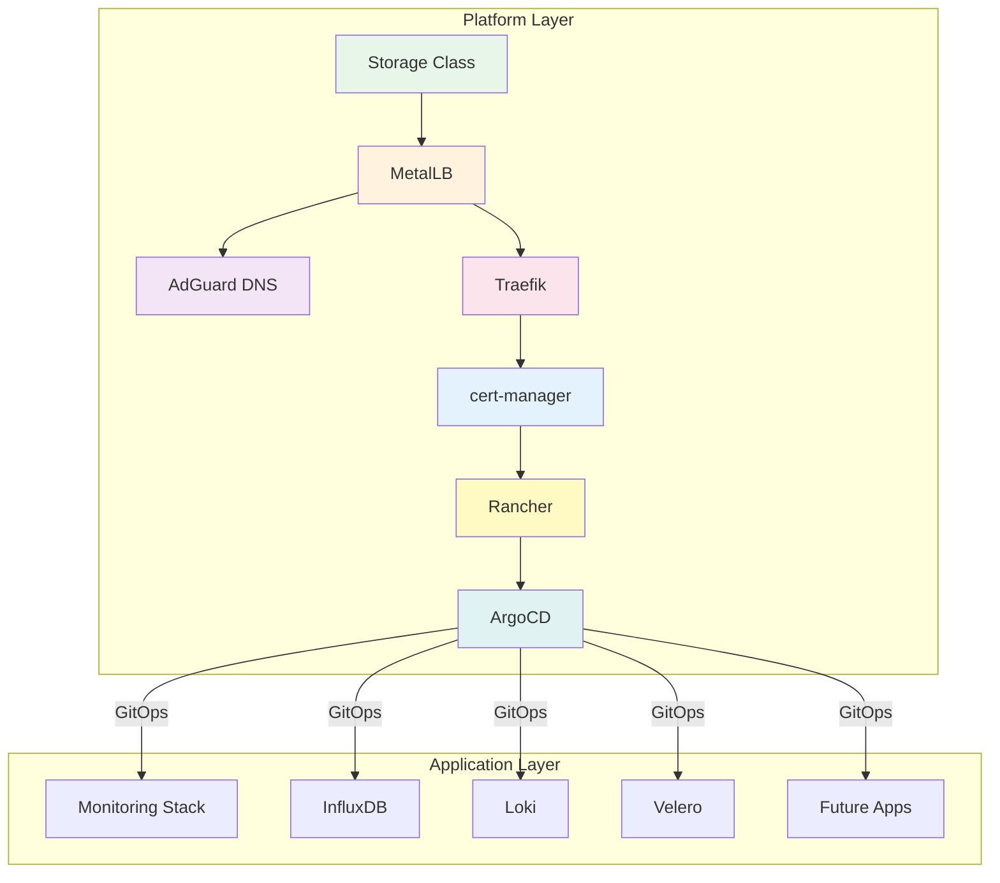

# Homelab Infrastructure

A modern Kubernetes homelab with clear separation between platform infrastructure and applications, using GitOps for application management.

## 🏗️ Architecture

The homelab follows a two-layer architecture:

### Platform Layer (Manual Bootstrap)
Core infrastructure components deployed once during initial setup:
- Storage provisioning
- Network load balancing (MetalLB)
- DNS services (AdGuard Home)
- Ingress routing (Traefik)
- SSL certificates (cert-manager)
- Kubernetes management (Rancher)
- GitOps controller (ArgoCD)

### Application Layer (GitOps)
Applications managed through ArgoCD:
- Monitoring stack (Prometheus/Grafana)
- Time-series database (InfluxDB)
- Log aggregation (Loki)
- Backup solutions (Velero)
- Additional applications



## 📁 Repository Structure

```
homelab2/
├── infrastructure/                # Platform infrastructure
│   ├── bootstrap/                # Unified bootstrap system
│   │   ├── bootstrap-infrastructure.sh  # Main bootstrap script
│   │   └── README.md            # Bootstrap documentation
│   ├── monitoring/              # Application configurations
│   │   ├── influxdb/           # Time-series database
│   │   └── kube-prometheus/    # Monitoring stack
│   └── docs/                   # Documentation
│
├── gitops/                     # ArgoCD managed applications
│   ├── bootstrap/             
│   │   └── applications.yaml   # App-of-apps for applications
│   └── applications/          # Application definitions
│       ├── monitoring.yaml    # Prometheus/Grafana
│       ├── influxdb.yaml     # InfluxDB
│       ├── loki.yaml         # Log aggregation
│       └── velero.yaml       # Backups
│
└── docs/                      # Project documentation
    └── IMPROVEMENTS_ROADMAP.md
```

## 🚀 Quick Start

### Prerequisites

- Kubernetes cluster (K3s/RKE2/etc)
- kubectl, helm, git, curl installed
- 50GB+ available storage
- IP range for LoadBalancer services (outside DHCP range)

### Installation

```bash
# 1. Clone repository
git clone https://github.com/sprevacomm/homelab2.git
cd homelab2

# 2. Bootstrap platform infrastructure
cd infrastructure/bootstrap
./bootstrap-infrastructure.sh \
  --metallb-range "192.168.1.200-192.168.1.250" \
  --domain "homelab.local" \
  --acme-email "admin@homelab.local"

# 3. Configure DNS
# Point *.homelab.local to Traefik LoadBalancer IP

# 4. Deploy applications via GitOps
kubectl apply -f ../../gitops/applications/

# 5. Access services
# - AdGuard: http://<adguard-ip>:3000
# - Traefik: https://traefik.homelab.local
# - Rancher: https://rancher.homelab.local
# - ArgoCD: https://argocd.homelab.local
```

## 🔧 Components

### Platform Layer (Bootstrap)
- **Storage Class** - Local path provisioner for persistent storage
- **MetalLB** - Bare metal load balancer
- **AdGuard Home** - DNS server with ad blocking
- **Traefik** - Ingress controller with automatic HTTPS
- **cert-manager** - Automatic SSL certificate management
- **Rancher** - Kubernetes cluster management UI
- **ArgoCD** - GitOps continuous delivery

### Application Layer (GitOps)
- **Prometheus/Grafana** - Metrics and visualization
- **InfluxDB** - Time-series database for Proxmox metrics
- **Loki** - Log aggregation
- **Velero** - Backup and disaster recovery
- **Alertmanager** - Alert management

## 🌐 Access Points

After DNS configuration:
- Platform Services:
  - AdGuard: `http://<adguard-ip>:3000` (DNS server)
  - Traefik: `https://traefik.homelab.local`
  - Rancher: `https://rancher.homelab.local`
  - ArgoCD: `https://argocd.homelab.local`
- Applications:
  - Grafana: `https://grafana.homelab.local`
  - Prometheus: `https://prometheus.homelab.local`
  - InfluxDB: `https://influxdb.homelab.local`

## 📚 Documentation

### Setup Guides
- [Bootstrap Guide](infrastructure/bootstrap/README.md) - Platform infrastructure setup
- [Improvements Roadmap](docs/IMPROVEMENTS_ROADMAP.md) - Architecture and enhancements
- [InfluxDB Setup](infrastructure/monitoring/influxdb/README.md) - Proxmox metrics collection

### Architecture
- [Platform vs Application Layer](docs/IMPROVEMENTS_ROADMAP.md#architecture-refactoring) - Design decisions
- [GitOps Workflow](infrastructure/bootstrap/README.md#architecture-overview) - How ArgoCD manages apps

### Operations
- [Disaster Recovery](infrastructure/bootstrap/README.md#disaster-recovery) - Rebuilding from scratch
- [Troubleshooting](infrastructure/bootstrap/README.md#troubleshooting) - Common issues
- [Maintenance](infrastructure/bootstrap/README.md#maintenance) - Updates and backups

## 🔐 Default Credentials

⚠️ **Change these immediately after installation!**

Platform Services:
- AdGuard: `admin` / `admin`
- Rancher: Bootstrap password set to `admin`
- ArgoCD: `admin` / (retrieve with: `kubectl -n argocd get secret argocd-initial-admin-secret -o jsonpath="{.data.password}" | base64 -d`)

Applications (when deployed):
- Grafana: `admin` / `prom-operator`
- InfluxDB: `admin` / (retrieve from secret)

## 🎯 Key Features

- **Clear Architecture** - Separation between platform and applications
- **GitOps for Apps** - Application deployment through ArgoCD
- **Automated SSL** - Let's Encrypt certificates via cert-manager
- **Local DNS** - AdGuard Home for network-wide DNS
- **Unified Bootstrap** - Single script platform deployment
- **Monitoring Ready** - Prometheus, Grafana, and InfluxDB included
- **Kubernetes Management** - Rancher UI for cluster operations

## 🛠️ Customization

Bootstrap script options:
```bash
./bootstrap-infrastructure.sh \
  --metallb-range "10.0.1.200-10.0.1.250" \
  --domain "lab.example.com" \
  --acme-email "admin@example.com"
```

For application customization:
1. **Update values**: Modify Helm values in `infrastructure/monitoring/*/values/`
2. **Add applications**: Create new manifests in `gitops/applications/`
3. **Adjust resources**: Edit resource limits in values files

## 📊 Monitoring

Recommended Grafana dashboards:
- `1860` - Node Exporter Full
- `7249` - Kubernetes Cluster Overview  
- `17346` - Traefik 3.0+
- `14584` - ArgoCD
- `10048` - Proxmox VE (with InfluxDB)
- `15356` - Proxmox Cluster (with InfluxDB)

## 🤝 Contributing

1. Fork the repository
2. Create feature branch
3. Commit changes
4. Push to branch
5. Create Pull Request

## 📄 License

This project is licensed under the MIT License.

## 🙏 Acknowledgments

Platform components:
- [MetalLB](https://metallb.universe.tf/) - Bare metal load balancer
- [AdGuard Home](https://adguard.com/) - Network-wide DNS and ad blocking
- [Traefik](https://traefik.io/) - Modern reverse proxy
- [cert-manager](https://cert-manager.io/) - Certificate management
- [Rancher](https://rancher.com/) - Kubernetes management
- [ArgoCD](https://argo-cd.readthedocs.io/) - GitOps continuous delivery

Application stack:
- [kube-prometheus-stack](https://github.com/prometheus-community/helm-charts) - Monitoring
- [InfluxDB](https://www.influxdata.com/) - Time-series database
- [Loki](https://grafana.com/oss/loki/) - Log aggregation
- [Velero](https://velero.io/) - Backup solution