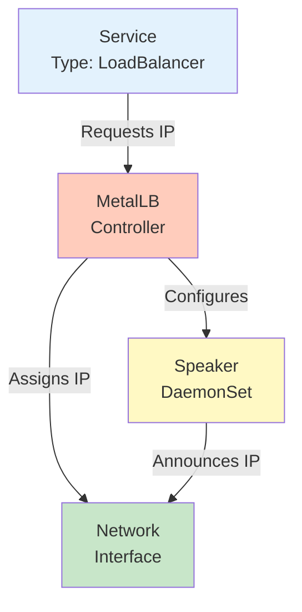

# MetalLB Documentation

## Overview

MetalLB is a load-balancer implementation for bare metal Kubernetes clusters using standard routing protocols. It provides a network load balancer implementation that integrates with standard network equipment, so that external services on bare metal clusters "just work".

**Version:** v0.15.2  
**Chart Version:** 0.15.2  
**Namespace:** `metallb-system`

## Architecture



### Components

1. **Controller** - Responsible for IP assignment
   - Watches for services requesting LoadBalancer
   - Assigns IPs from configured pools
   - Single replica deployment

2. **Speaker** - Responsible for announcing services
   - Runs on every node (DaemonSet)
   - Announces service IPs using L2 (ARP/NDP) or BGP
   - Responds to ARP requests for service IPs

## Installation

### Via ArgoCD (Recommended)

MetalLB is automatically deployed via ArgoCD using the app-of-apps pattern:

```yaml
# Already configured in gitops/infra/metallb/application.yaml
apiVersion: argoproj.io/v1alpha1
kind: Application
metadata:
  name: metallb
  namespace: argocd
spec:
  source:
    repoURL: https://metallb.github.io/metallb
    targetRevision: 0.15.2
    chart: metallb
```

### Manual Installation

```bash
# Add Helm repository
helm repo add metallb https://metallb.github.io/metallb
helm repo update

# Create namespace
kubectl create namespace metallb-system

# Install MetalLB
helm install metallb metallb/metallb \
  --namespace metallb-system \
  --version 0.15.2

# Apply configuration
kubectl apply -f manifests/base/
```

## Configuration

### IP Address Pool

Configure the IP range that MetalLB can assign to LoadBalancer services:

```yaml
# manifests/base/ipaddresspool.yaml
apiVersion: metallb.io/v1beta1
kind: IPAddressPool
metadata:
  name: default-pool
  namespace: metallb-system
spec:
  addresses:
    - 192.168.1.200-192.168.1.250  # Adjust to your network
```

**Important:** Choose IPs that are:
- Outside your DHCP server's range
- On the same subnet as your nodes
- Not used by other devices

### L2 Advertisement

Configure how MetalLB announces services:

```yaml
# manifests/base/l2advertisement.yaml
apiVersion: metallb.io/v1beta1
kind: L2Advertisement
metadata:
  name: default-l2-advertisement
  namespace: metallb-system
spec:
  ipAddressPools:
    - default-pool
```

### Configuration Options

#### Multiple IP Pools
```yaml
apiVersion: metallb.io/v1beta1
kind: IPAddressPool
metadata:
  name: production-pool
  namespace: metallb-system
spec:
  addresses:
    - 192.168.1.200-192.168.1.210
  autoAssign: false  # Require explicit assignment
---
apiVersion: metallb.io/v1beta1
kind: IPAddressPool
metadata:
  name: development-pool
  namespace: metallb-system
spec:
  addresses:
    - 192.168.1.211-192.168.1.220
```

#### BGP Configuration (Advanced)
```yaml
apiVersion: metallb.io/v1beta2
kind: BGPPeer
metadata:
  name: router
  namespace: metallb-system
spec:
  myASN: 64500
  peerASN: 64501
  peerAddress: 192.168.1.1
  peerPort: 179
```

## Usage

### Creating a LoadBalancer Service

```yaml
apiVersion: v1
kind: Service
metadata:
  name: my-service
spec:
  type: LoadBalancer
  ports:
    - port: 80
      targetPort: 8080
  selector:
    app: my-app
```

### Requesting a Specific IP

```yaml
apiVersion: v1
kind: Service
metadata:
  name: my-service
  annotations:
    metallb.universe.tf/loadBalancerIPs: "192.168.1.200"
spec:
  type: LoadBalancer
  ports:
    - port: 80
      targetPort: 8080
  selector:
    app: my-app
```

### Using IP Pools

```yaml
apiVersion: v1
kind: Service
metadata:
  name: my-service
  annotations:
    metallb.universe.tf/ip-allocated-from-pool: production-pool
spec:
  type: LoadBalancer
  ports:
    - port: 80
      targetPort: 8080
  selector:
    app: my-app
```

### Sharing IPs Between Services

```yaml
apiVersion: v1
kind: Service
metadata:
  name: service-http
  annotations:
    metallb.universe.tf/loadBalancerIPs: "192.168.1.200"
    metallb.universe.tf/allow-shared-ip: "shared"
spec:
  type: LoadBalancer
  ports:
    - port: 80
      targetPort: 8080
  selector:
    app: my-app
---
apiVersion: v1
kind: Service
metadata:
  name: service-https
  annotations:
    metallb.universe.tf/loadBalancerIPs: "192.168.1.200"
    metallb.universe.tf/allow-shared-ip: "shared"
spec:
  type: LoadBalancer
  ports:
    - port: 443
      targetPort: 8443
  selector:
    app: my-app
```

## Maintenance

### Monitoring

1. **Check Controller Status:**
   ```bash
   kubectl -n metallb-system get pods
   kubectl -n metallb-system logs -l app.kubernetes.io/component=controller
   ```

2. **Check Speaker Status:**
   ```bash
   kubectl -n metallb-system logs -l app.kubernetes.io/component=speaker
   ```

3. **View Assigned IPs:**
   ```bash
   kubectl get services --all-namespaces -o wide | grep LoadBalancer
   ```

4. **Check IP Pool Usage:**
   ```bash
   kubectl get ipaddresspool -n metallb-system -o wide
   ```

### Troubleshooting

#### Service Stuck in Pending

1. **Check if MetalLB is running:**
   ```bash
   kubectl get pods -n metallb-system
   ```

2. **Check controller logs:**
   ```bash
   kubectl logs -n metallb-system -l app.kubernetes.io/component=controller
   ```

3. **Verify IP pool configuration:**
   ```bash
   kubectl get ipaddresspool -n metallb-system -o yaml
   ```

#### IP Not Accessible

1. **Check speaker logs on the node:**
   ```bash
   kubectl logs -n metallb-system -l app.kubernetes.io/component=speaker --all-containers
   ```

2. **Verify ARP entries (on client machine):**
   ```bash
   arp -a | grep <service-ip>
   ```

3. **Check L2Advertisement:**
   ```bash
   kubectl get l2advertisement -n metallb-system -o yaml
   ```

#### Common Issues and Solutions

**Issue: "no IP left in the pool"**
- Solution: Expand IP range in IPAddressPool or release unused IPs

**Issue: "ARP requests not answered"**
- Check if speaker pods are running on all nodes
- Verify network connectivity between nodes
- Check for firewall rules blocking ARP

**Issue: "IP conflicts"**
- Ensure IP range doesn't overlap with DHCP
- Check for static IPs in the range
- Use `arping` to detect conflicts

### Updates

1. **Update via ArgoCD:**
   - Modify `targetRevision` in `application.yaml`
   - Commit and push changes
   - ArgoCD will handle the upgrade

2. **Manual Update:**
   ```bash
   helm upgrade metallb metallb/metallb \
     --namespace metallb-system \
     --version <new-version>
   ```

### Backup Configuration

```bash
# Backup MetalLB resources
kubectl get ipaddresspool,l2advertisement,bgppeer,bgpadvertisement,community \
  -n metallb-system -o yaml > metallb-config-backup.yaml
```

## Advanced Configuration

### Layer 2 Mode Settings

```yaml
apiVersion: metallb.io/v1beta1
kind: L2Advertisement
metadata:
  name: example
  namespace: metallb-system
spec:
  ipAddressPools:
    - default-pool
  interfaces:  # Limit to specific interfaces
    - eth0
    - eth1
  nodeSelectors:  # Limit to specific nodes
    - matchLabels:
        node-role.kubernetes.io/worker: "true"
```

### BGP Mode (Alternative to L2)

```yaml
# BGP Configuration
apiVersion: metallb.io/v1beta2
kind: BGPPeer
metadata:
  name: router
  namespace: metallb-system
spec:
  myASN: 64500
  peerASN: 64501
  peerAddress: 192.168.1.1
  peerPort: 179
  routerID: 192.168.1.10
  keepaliveTime: 30s
  holdTime: 90s
---
apiVersion: metallb.io/v1beta1
kind: BGPAdvertisement
metadata:
  name: example
  namespace: metallb-system
spec:
  ipAddressPools:
    - default-pool
  aggregationLength: 32
  communities:
    - 65535:65282
```

### FRRouting Integration

For advanced BGP configurations, MetalLB can integrate with FRRouting:

```yaml
apiVersion: frrk8s.metallb.io/v1beta1
kind: FRRConfiguration
metadata:
  name: example
  namespace: metallb-system
spec:
  bgp:
    routers:
      - asn: 64500
        id: 192.168.1.10
        neighbors:
          - address: 192.168.1.1
            asn: 64501
```

## Performance Tuning

### Speaker Configuration

```yaml
# In Helm values
speaker:
  resources:
    requests:
      cpu: 100m
      memory: 100Mi
    limits:
      cpu: 100m
      memory: 100Mi
  tolerations:
    - key: node-role.kubernetes.io/master
      effect: NoSchedule
```

### Controller Configuration

```yaml
# In Helm values
controller:
  resources:
    requests:
      cpu: 100m
      memory: 100Mi
    limits:
      cpu: 100m
      memory: 100Mi
```

## Security Considerations

1. **Network Isolation:**
   - Use separate VLANs for different environments
   - Configure firewall rules for service IPs

2. **RBAC:**
   - MetalLB uses least-privilege RBAC
   - Review and audit permissions regularly

3. **IP Management:**
   - Document IP allocations
   - Use IP pools to segregate services
   - Monitor for IP conflicts

## Integration Examples

### With Traefik

```yaml
# Traefik service requesting specific IP
apiVersion: v1
kind: Service
metadata:
  name: traefik
  namespace: traefik
  annotations:
    metallb.universe.tf/loadBalancerIPs: "192.168.1.200"
spec:
  type: LoadBalancer
  ports:
    - port: 80
      name: web
    - port: 443
      name: websecure
  selector:
    app.kubernetes.io/name: traefik
```

### With Multiple Ingress Controllers

```yaml
# Separate IPs for different ingress controllers
---
# Traefik
apiVersion: v1
kind: Service
metadata:
  name: traefik
  annotations:
    metallb.universe.tf/loadBalancerIPs: "192.168.1.200"
spec:
  type: LoadBalancer
---
# Nginx
apiVersion: v1
kind: Service
metadata:
  name: nginx-ingress
  annotations:
    metallb.universe.tf/loadBalancerIPs: "192.168.1.201"
spec:
  type: LoadBalancer
```

## Monitoring and Observability

### Prometheus Metrics

MetalLB exposes metrics on port 7472:

```yaml
# ServiceMonitor for Prometheus Operator
apiVersion: monitoring.coreos.com/v1
kind: ServiceMonitor
metadata:
  name: metallb
  namespace: metallb-system
spec:
  selector:
    matchLabels:
      app.kubernetes.io/name: metallb
  endpoints:
    - port: metrics
      interval: 30s
```

Key metrics:
- `metallb_allocator_addresses_total` - Total IPs in pools
- `metallb_allocator_addresses_in_use` - IPs currently allocated
- `metallb_speaker_announced` - Services being announced

### Grafana Dashboard

Import dashboard ID: 14127 (MetalLB Dashboard)

## Best Practices

1. **IP Planning:**
   - Reserve IPs outside DHCP range
   - Document IP allocations
   - Plan for growth

2. **High Availability:**
   - Speaker runs on all nodes by default
   - Controller handles leader election
   - No single point of failure in L2 mode

3. **Testing:**
   - Test failover by draining nodes
   - Verify ARP/NDP responses
   - Monitor for IP conflicts

4. **Documentation:**
   - Keep IP allocation spreadsheet
   - Document service-to-IP mappings
   - Note any custom configurations

## References

- [Official Documentation](https://metallb.universe.tf/)
- [GitHub Repository](https://github.com/metallb/metallb)
- [Configuration Reference](https://metallb.universe.tf/configuration/)
- [Troubleshooting Guide](https://metallb.universe.tf/troubleshooting/)