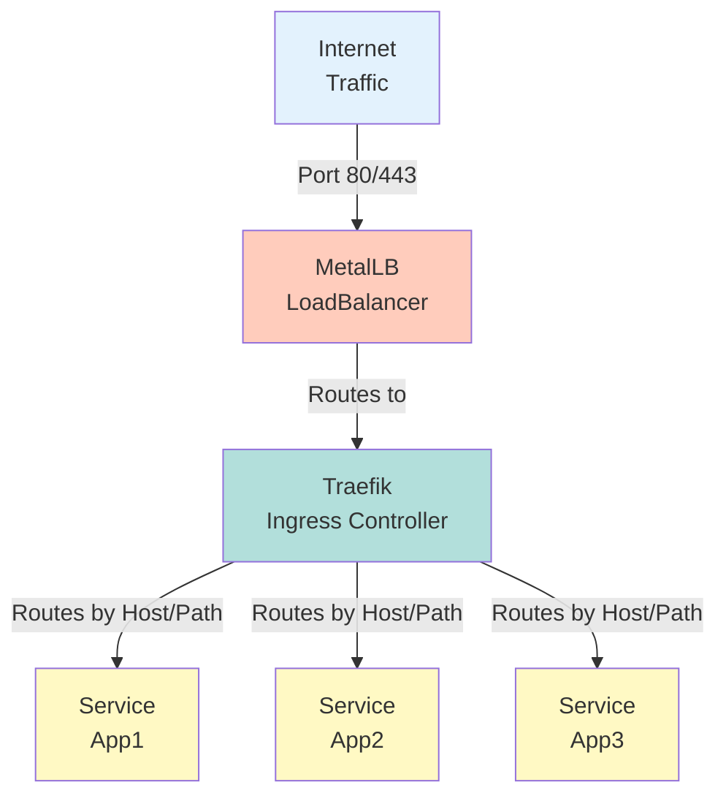

# Traefik Documentation

## Overview

Traefik is a modern HTTP reverse proxy and load balancer that makes deploying microservices easy. It integrates with Kubernetes and automatically discovers services, making it an ideal ingress controller for dynamic environments.

**Version:** v3.4.3  
**Chart Version:** 36.3.0  
**Namespace:** `traefik`

## Architecture



### Components

1. **Entrypoints** - Network entry points (ports 80, 443)
2. **Routers** - Route requests to services based on rules
3. **Services** - Load balance requests to pods
4. **Middlewares** - Transform requests (auth, headers, etc.)
5. **Providers** - Discover routes (Kubernetes Ingress/CRD)

## Installation

### Via ArgoCD (Recommended)

Traefik is automatically deployed via ArgoCD:

```yaml
# gitops/infra/traefik/application.yaml
apiVersion: argoproj.io/v1alpha1
kind: Application
metadata:
  name: traefik
  namespace: argocd
spec:
  sources:
    - repoURL: https://github.com/sprevacomm/homelab2.git
      targetRevision: main
      ref: values
    - repoURL: https://helm.traefik.io/traefik
      targetRevision: 36.3.0
      chart: traefik
      helm:
        valueFiles:
          - $values/gitops/infra/traefik/values/values.yaml
```

### Manual Installation

```bash
# Add Helm repository
helm repo add traefik https://helm.traefik.io/traefik
helm repo update

# Create namespace
kubectl create namespace traefik

# Install Traefik
helm install traefik traefik/traefik \
  --namespace traefik \
  --version 36.3.0 \
  --values values/values.yaml
```

## Configuration

### Key Configuration Files

1. **values/values.yaml** - Helm values for Traefik
2. **manifests/base/** - Additional Kubernetes resources
   - `default-headers-middleware.yaml` - Security headers
   - `traefik-dashboard-ingressroute.yaml` - Dashboard access

### Entrypoints Configuration

```yaml
ports:
  web:
    port: 80
    expose:
      default: true
    exposedPort: 80
    protocol: TCP
  websecure:
    port: 443
    expose:
      default: true
    exposedPort: 443
    protocol: TCP
    tls:
      enabled: true
```

### Let's Encrypt Configuration

```yaml
additionalArguments:
  # HTTP to HTTPS redirect
  - "--entrypoints.web.http.redirections.entrypoint.to=websecure"
  - "--entrypoints.web.http.redirections.entrypoint.scheme=https"
  # Let's Encrypt configuration
  - "--certificatesresolvers.letsencrypt.acme.email=admin@susdomain.name"
  - "--certificatesresolvers.letsencrypt.acme.storage=/data/acme.json"
  - "--certificatesresolvers.letsencrypt.acme.httpchallenge.entrypoint=web"
  - "--certificatesresolvers.letsencrypt.acme.tlschallenge=true"
  # Use staging for testing (uncomment for production)
  # - "--certificatesresolvers.letsencrypt.acme.caserver=https://acme-staging-v02.api.letsencrypt.org/directory"
```

### LoadBalancer Configuration

```yaml
service:
  type: LoadBalancer
  annotations:
    metallb.universe.tf/loadBalancerIPs: "192.168.1.200"
```

### Providers Configuration

```yaml
providers:
  kubernetesIngress:
    enabled: true
    allowCrossNamespace: true
    publishedService:
      enabled: true
  kubernetesCRD:
    enabled: true
    allowCrossNamespace: true
```

## Usage

### Basic Ingress

```yaml
apiVersion: networking.k8s.io/v1
kind: Ingress
metadata:
  name: my-app
  annotations:
    traefik.ingress.kubernetes.io/router.tls.certresolver: letsencrypt
spec:
  ingressClassName: traefik
  rules:
    - host: myapp.susdomain.name
      http:
        paths:
          - path: /
            pathType: Prefix
            backend:
              service:
                name: my-app
                port:
                  number: 80
  tls:
    - hosts:
        - myapp.susdomain.name
      secretName: myapp-tls
```

### IngressRoute (CRD)

```yaml
apiVersion: traefik.io/v1alpha1
kind: IngressRoute
metadata:
  name: my-app
spec:
  entryPoints:
    - websecure
  routes:
    - match: Host(`myapp.susdomain.name`)
      kind: Rule
      services:
        - name: my-app
          port: 80
      middlewares:
        - name: default-headers
          namespace: traefik
  tls:
    certResolver: letsencrypt
```

### Middlewares

#### Default Security Headers
```yaml
# Already configured in manifests/base/default-headers-middleware.yaml
apiVersion: traefik.io/v1alpha1
kind: Middleware
metadata:
  name: default-headers
  namespace: traefik
spec:
  headers:
    browserXssFilter: true
    contentTypeNosniff: true
    forceSTSHeader: true
    stsIncludeSubdomains: true
    stsPreload: true
    stsSeconds: 15552000
    customFrameOptionsValue: SAMEORIGIN
    customRequestHeaders:
      X-Forwarded-Proto: https
```

#### Basic Authentication
```yaml
apiVersion: traefik.io/v1alpha1
kind: Middleware
metadata:
  name: basic-auth
spec:
  basicAuth:
    secret: basic-auth-secret
---
apiVersion: v1
kind: Secret
metadata:
  name: basic-auth-secret
data:
  users: |
    # admin:password (use htpasswd to generate)
    YWRtaW46JDJ5JDEwJDlGM0VzLkZIQzI5Qk1XUi5IUUdUL09Zby5nUmVPM2p0V3A5cHdUZTlHZDdIYjUzVEhxCg==
```

#### Rate Limiting
```yaml
apiVersion: traefik.io/v1alpha1
kind: Middleware
metadata:
  name: rate-limit
spec:
  rateLimit:
    average: 100
    burst: 50
    period: 1m
```

#### IP Whitelist
```yaml
apiVersion: traefik.io/v1alpha1
kind: Middleware
metadata:
  name: ip-whitelist
spec:
  ipWhiteList:
    sourceRange:
      - 192.168.1.0/24
      - 10.0.0.0/8
```

### Advanced Routing

#### Path-based Routing
```yaml
apiVersion: traefik.io/v1alpha1
kind: IngressRoute
metadata:
  name: multi-path
spec:
  entryPoints:
    - websecure
  routes:
    - match: Host(`api.susdomain.name`) && PathPrefix(`/v1`)
      kind: Rule
      services:
        - name: api-v1
          port: 80
    - match: Host(`api.susdomain.name`) && PathPrefix(`/v2`)
      kind: Rule
      services:
        - name: api-v2
          port: 80
```

#### Header-based Routing
```yaml
apiVersion: traefik.io/v1alpha1
kind: IngressRoute
metadata:
  name: header-routing
spec:
  entryPoints:
    - websecure
  routes:
    - match: Host(`app.susdomain.name`) && Headers(`X-Version`, `beta`)
      kind: Rule
      services:
        - name: app-beta
          port: 80
    - match: Host(`app.susdomain.name`)
      kind: Rule
      services:
        - name: app-stable
          port: 80
```

## Dashboard Access

### Via IngressRoute
The dashboard is accessible at `https://traefik.susdomain.name` once DNS is configured.

### Via Port Forward
```bash
kubectl port-forward deployment/traefik -n traefik 8080:8080
# Access at http://localhost:8080/dashboard/
```

### Securing the Dashboard
```yaml
apiVersion: traefik.io/v1alpha1
kind: IngressRoute
metadata:
  name: traefik-dashboard-secure
spec:
  entryPoints:
    - websecure
  routes:
    - match: Host(`traefik.susdomain.name`)
      kind: Rule
      services:
        - name: api@internal
          kind: TraefikService
      middlewares:
        - name: dashboard-auth
        - name: default-headers
---
apiVersion: traefik.io/v1alpha1
kind: Middleware
metadata:
  name: dashboard-auth
spec:
  basicAuth:
    secret: dashboard-auth-secret
```

## SSL/TLS Management

### Let's Encrypt Production

1. **Enable Production ACME:**
   ```yaml
   # Remove or comment out the staging server line
   additionalArguments:
     # - "--certificatesresolvers.letsencrypt.acme.caserver=https://acme-staging-v02.api.letsencrypt.org/directory"
   ```

2. **Enable Persistence:**
   ```yaml
   persistence:
     enabled: true
     size: 1Gi
     path: /data
     accessMode: ReadWriteOnce
     storageClass: "your-storage-class"  # Must be configured
   ```

### Custom Certificates

```yaml
apiVersion: v1
kind: Secret
metadata:
  name: custom-cert
  namespace: default
type: kubernetes.io/tls
data:
  tls.crt: <base64-encoded-cert>
  tls.key: <base64-encoded-key>
---
apiVersion: traefik.io/v1alpha1
kind: IngressRoute
metadata:
  name: custom-cert-app
spec:
  entryPoints:
    - websecure
  routes:
    - match: Host(`custom.susdomain.name`)
      kind: Rule
      services:
        - name: my-app
          port: 80
  tls:
    secretName: custom-cert
```

### Certificate Stores

```yaml
apiVersion: traefik.io/v1alpha1
kind: TLSStore
metadata:
  name: default
  namespace: traefik
spec:
  defaultCertificate:
    secretName: default-cert
  certificates:
    - secretName: cert1
    - secretName: cert2
```

## Monitoring and Observability

### Metrics

Traefik exposes Prometheus metrics:

```yaml
metrics:
  prometheus:
    enabled: true
    entryPoint: metrics
    addEntryPointsLabels: true
    addServicesLabels: true
```

Key metrics:
- `traefik_entrypoint_requests_total` - Request count per entrypoint
- `traefik_entrypoint_request_duration_seconds` - Request duration
- `traefik_service_requests_total` - Request count per service
- `traefik_service_request_duration_seconds` - Service response time

### Grafana Dashboard

Import dashboard ID: 17346 (Traefik Official Dashboard)

### Access Logs

```yaml
logs:
  access:
    enabled: true
    format: json
    fields:
      defaultMode: keep
      headers:
        defaultMode: drop
        names:
          User-Agent: keep
          Authorization: drop
```

## Maintenance

### Health Checks

1. **Check Pod Status:**
   ```bash
   kubectl get pods -n traefik
   kubectl describe pod traefik-xxxxx -n traefik
   ```

2. **Check Service:**
   ```bash
   kubectl get svc -n traefik
   ```

3. **Check Logs:**
   ```bash
   kubectl logs -n traefik deployment/traefik
   ```

### Troubleshooting

#### Certificate Issues

1. **Check ACME logs:**
   ```bash
   kubectl logs -n traefik deployment/traefik | grep acme
   ```

2. **Verify DNS:**
   ```bash
   nslookup myapp.susdomain.name
   ```

3. **Check certificate resolver:**
   ```bash
   kubectl exec -n traefik deployment/traefik -- cat /data/acme.json
   ```

#### Routing Issues

1. **Check IngressRoute:**
   ```bash
   kubectl describe ingressroute my-app
   ```

2. **Verify service exists:**
   ```bash
   kubectl get svc my-app
   ```

3. **Test with curl:**
   ```bash
   curl -v https://myapp.susdomain.name
   ```

#### Common Issues

**Issue: "404 Page Not Found"**
- Check if route matches are correct
- Verify service name and port
- Check namespace references

**Issue: "Bad Gateway"**
- Service might be down
- Wrong port specified
- Network policies blocking traffic

**Issue: "SSL Certificate Error"**
- DNS not properly configured
- Let's Encrypt rate limited
- Using staging certificates

### Updates

1. **Via ArgoCD:**
   - Update `targetRevision` in `application.yaml`
   - Commit and push changes

2. **Manual Update:**
   ```bash
   helm upgrade traefik traefik/traefik \
     --namespace traefik \
     --version <new-version> \
     --values values/values.yaml
   ```

## Advanced Configuration

### Circuit Breaker

```yaml
apiVersion: traefik.io/v1alpha1
kind: ServersTransport
metadata:
  name: circuit-breaker
spec:
  serverHealthCheck:
    interval: 10s
    timeout: 3s
    scheme: http
    path: /health
    method: GET
    expectedStatus: 200
```

### Canary Deployments

```yaml
apiVersion: traefik.io/v1alpha1
kind: TraefikService
metadata:
  name: canary
spec:
  weighted:
    services:
      - name: app-stable
        port: 80
        weight: 90
      - name: app-canary
        port: 80
        weight: 10
```

### Sticky Sessions

```yaml
apiVersion: traefik.io/v1alpha1
kind: TraefikService
metadata:
  name: sticky-app
spec:
  weighted:
    services:
      - name: my-app
        port: 80
    sticky:
      cookie:
        name: server_id
        httpOnly: true
        secure: true
```

### TCP Services

```yaml
apiVersion: traefik.io/v1alpha1
kind: IngressRouteTCP
metadata:
  name: postgres
spec:
  entryPoints:
    - postgres
  routes:
    - match: HostSNI(`*`)
      services:
        - name: postgres
          port: 5432
---
# Add to values.yaml
ports:
  postgres:
    port: 5432
    expose:
      default: true
    exposedPort: 5432
    protocol: TCP
```

## Security Best Practices

1. **Always use HTTPS:**
   - Enable automatic redirects
   - Use strong TLS configurations

2. **Implement Security Headers:**
   - Use default-headers middleware
   - Add CSP headers as needed

3. **Rate Limiting:**
   - Protect APIs with rate limits
   - Different limits for different endpoints

4. **Access Control:**
   - Use IP whitelisting for admin interfaces
   - Implement authentication middlewares

5. **Regular Updates:**
   - Keep Traefik updated
   - Monitor security advisories

## Integration Examples

### With Cert-Manager

```yaml
apiVersion: networking.k8s.io/v1
kind: Ingress
metadata:
  name: app-with-cert-manager
  annotations:
    cert-manager.io/cluster-issuer: letsencrypt-prod
spec:
  ingressClassName: traefik
  rules:
    - host: app.susdomain.name
      http:
        paths:
          - path: /
            pathType: Prefix
            backend:
              service:
                name: my-app
                port:
                  number: 80
  tls:
    - hosts:
        - app.susdomain.name
      secretName: app-tls
```

### With External-DNS

```yaml
apiVersion: networking.k8s.io/v1
kind: Ingress
metadata:
  name: app-with-external-dns
  annotations:
    external-dns.alpha.kubernetes.io/hostname: app.susdomain.name
    external-dns.alpha.kubernetes.io/ttl: "300"
spec:
  ingressClassName: traefik
  rules:
    - host: app.susdomain.name
      http:
        paths:
          - path: /
            pathType: Prefix
            backend:
              service:
                name: my-app
                port:
                  number: 80
```

## Performance Tuning

### Resource Allocation

```yaml
resources:
  requests:
    cpu: 100m
    memory: 128Mi
  limits:
    cpu: 500m
    memory: 512Mi
```

### Scaling

```yaml
deployment:
  replicas: 1  # Limited to 1 with ACME storage
  
# For HA without ACME, use multiple replicas:
# replicas: 3
# podAntiAffinity:
#   requiredDuringSchedulingIgnoredDuringExecution:
#     - labelSelector:
#         matchLabels:
#           app.kubernetes.io/name: traefik
#       topologyKey: kubernetes.io/hostname
```

### Connection Limits

```yaml
additionalArguments:
  - "--entrypoints.web.transport.respondingTimeouts.readTimeout=30s"
  - "--entrypoints.web.transport.respondingTimeouts.writeTimeout=30s"
  - "--entrypoints.web.transport.respondingTimeouts.idleTimeout=180s"
  - "--entrypoints.websecure.transport.respondingTimeouts.readTimeout=30s"
  - "--entrypoints.websecure.transport.respondingTimeouts.writeTimeout=30s"
  - "--entrypoints.websecure.transport.respondingTimeouts.idleTimeout=180s"
```

## References

- [Official Documentation](https://doc.traefik.io/traefik/)
- [Helm Chart](https://github.com/traefik/traefik-helm-chart)
- [Migration Guide](https://doc.traefik.io/traefik/migration/v2-to-v3/)
- [Let's Encrypt Documentation](https://doc.traefik.io/traefik/https/acme/)
- [Kubernetes Provider](https://doc.traefik.io/traefik/providers/kubernetes-ingress/)
- [Middleware Catalog](https://doc.traefik.io/traefik/middlewares/overview/)