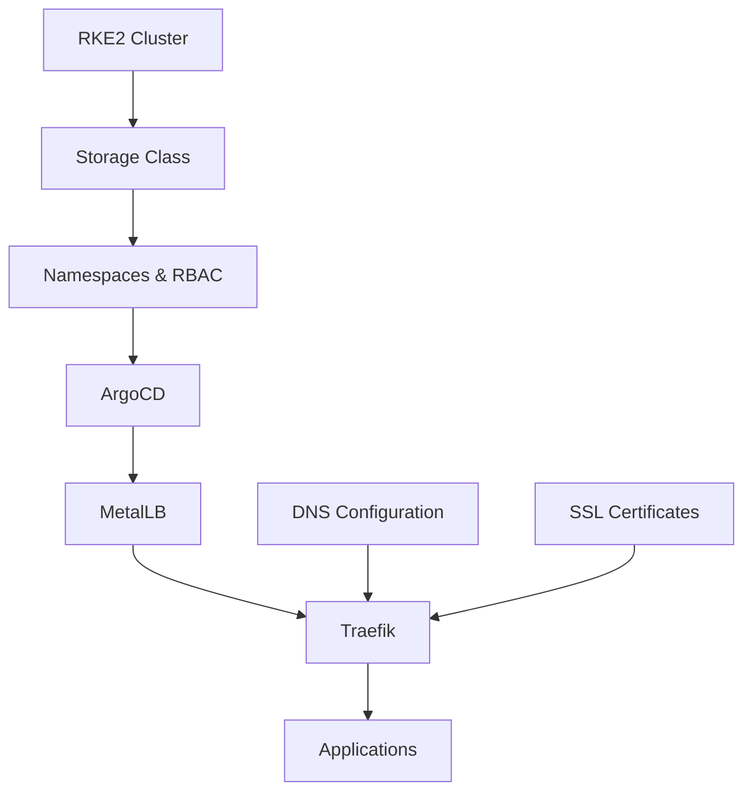

# Installation Sequence Guide

This document provides the detailed installation sequence for setting up the complete homelab infrastructure. The order is critical for proper functionality.

## Installation Overview

```
┌─────────────────────────────────────────────────────────────┐
│                    Installation Flow                          │
├─────────────────────────────────────────────────────────────┤
│ 1. Prerequisites Check                                        │
│    └─> Verify cluster, tools, network                        │
│ 2. Storage Class Setup                                        │
│    └─> Required for persistent volumes                       │
│ 3. Pre-ArgoCD Setup                                          │
│    └─> Run prerequisites.sh script                           │
│ 4. ArgoCD Installation                                        │
│    └─> Bootstrap GitOps controller                           │
│ 5. Infrastructure Deployment                                  │
│    └─> Deploy MetalLB → Traefik → Apps                      │
│ 6. DNS Configuration                                          │
│    └─> Configure external DNS                                │
│ 7. Post-Installation                                          │
│    └─> Security hardening, backups                          │
└─────────────────────────────────────────────────────────────┘
```

## Detailed Installation Sequence

### Phase 1: Prerequisites Verification

Before starting any installation, verify:

1. **Cluster Access**
   ```bash
   kubectl cluster-info
   kubectl get nodes
   # Expected: All nodes Ready
   ```

2. **Required Tools**
   ```bash
   # Check kubectl
   kubectl version --client
   
   # Check helm
   helm version
   
   # Check git
   git --version
   ```

3. **Network Planning**
   - Document your network range (e.g., 192.168.1.0/24)
   - Identify DHCP range (e.g., 192.168.1.1-199)
   - Plan MetalLB range (e.g., 192.168.1.200-250)
   - Ensure no IP conflicts

### Phase 2: Storage Class Setup

**CRITICAL**: This must be done BEFORE installing any applications that require persistence.

#### Option 1: Local Path Provisioner (Recommended for Homelab)
```bash
# Install Rancher Local Path Provisioner
kubectl apply -f https://raw.githubusercontent.com/rancher/local-path-provisioner/v0.0.24/deploy/local-path-storage.yaml

# Verify installation
kubectl get storageclass
kubectl get pods -n local-path-storage

# Set as default storage class
kubectl patch storageclass local-path -p '{"metadata": {"annotations":{"storageclass.kubernetes.io/is-default-class":"true"}}}'
```

#### Option 2: NFS Storage Class
```bash
# Install NFS provisioner
helm repo add nfs-subdir-external-provisioner https://kubernetes-sigs.github.io/nfs-subdir-external-provisioner/
helm install nfs-subdir-external-provisioner nfs-subdir-external-provisioner/nfs-subdir-external-provisioner \
  --set nfs.server=192.168.1.100 \
  --set nfs.path=/nfs/share \
  --set storageClass.defaultClass=true
```

#### Option 3: OpenEBS (Advanced)
```bash
# Install OpenEBS
kubectl apply -f https://openebs.github.io/charts/openebs-operator.yaml

# Wait for pods
kubectl get pods -n openebs -w

# Set default storage class
kubectl patch storageclass openebs-hostpath -p '{"metadata": {"annotations":{"storageclass.kubernetes.io/is-default-class":"true"}}}'
```

### Phase 3: Pre-ArgoCD Setup

Run the prerequisites script to prepare the cluster:

```bash
# Clone repository
git clone https://github.com/sprevacomm/homelab2.git
cd homelab2/gitops/infra

# Make script executable
chmod +x prerequisites.sh

# Run prerequisites setup
./prerequisites.sh
```

This script will:
- Create necessary namespaces
- Install and configure storage class (if not present)
- Set up RBAC prerequisites
- Verify cluster readiness

### Phase 4: ArgoCD Installation

```bash
# Navigate to ArgoCD directory
cd argocd

# Review and update values
# IMPORTANT: Edit values/values.yaml
# - Update domain from 'argocd.susdomain.name' to your domain
# - Update admin password hash if desired

# Run bootstrap script
./bootstrap.sh

# Wait for ArgoCD to be ready
kubectl wait --for=condition=Ready pods -l app.kubernetes.io/name=argocd-server -n argocd --timeout=300s
```

### Phase 5: Infrastructure Deployment

The deployment order is critical due to dependencies:

```
MetalLB (Load Balancer) → Traefik (Ingress) → Applications
```

1. **Update Configuration Files**
   ```bash
   # Update MetalLB IP range
   vim metallb/manifests/base/ipaddresspool.yaml
   # Change: 192.168.1.200-192.168.1.250 to your range
   
   # Update Traefik LoadBalancer IP
   vim traefik/values/values.yaml
   # Change: metallb.universe.tf/loadBalancerIPs: "192.168.1.200"
   # Change: email address for Let's Encrypt
   
   # Update all domain references
   find . -type f -name "*.yaml" -exec grep -l "susdomain.name" {} \; | xargs sed -i 's/susdomain.name/yourdomain.com/g'
   ```

2. **Commit Changes**
   ```bash
   git add -A
   git commit -m "Update configuration for my environment"
   git push origin main
   ```

3. **Deploy Infrastructure**
   ```bash
   # Apply app-of-apps
   kubectl apply -f argocd/manifests/base/app-of-apps.yaml
   
   # Watch deployment progress
   watch kubectl get applications -n argocd
   ```

### Phase 6: DNS Configuration

After MetalLB and Traefik are running:

1. **Get LoadBalancer IP**
   ```bash
   kubectl get svc -n traefik traefik
   # Note the EXTERNAL-IP (e.g., 192.168.1.200)
   ```

2. **Configure DNS**
   - Add wildcard A record: `*.yourdomain.com → 192.168.1.200`
   - Or individual records:
     - `argocd.yourdomain.com → 192.168.1.200`
     - `traefik.yourdomain.com → 192.168.1.200`
     - etc.

3. **Verify DNS**
   ```bash
   nslookup argocd.yourdomain.com
   dig traefik.yourdomain.com
   ```

### Phase 7: Post-Installation

1. **Access ArgoCD UI**
   ```bash
   # Get admin password
   kubectl -n argocd get secret argocd-initial-admin-secret -o jsonpath="{.data.password}" | base64 -d
   
   # Access UI
   https://argocd.yourdomain.com
   ```

2. **Change Admin Password**
   ```bash
   argocd login argocd.yourdomain.com
   argocd account update-password
   ```

3. **Enable Traefik Persistence**
   ```bash
   # Edit traefik/values/values.yaml
   # Set persistence.enabled: true
   git add -A && git commit -m "Enable Traefik persistence" && git push
   
   # Sync application
   argocd app sync traefik
   ```

4. **Switch to Production Let's Encrypt**
   ```bash
   # Edit traefik/values/values.yaml
   # Comment out the staging server line
   git add -A && git commit -m "Enable production Let's Encrypt" && git push
   argocd app sync traefik
   ```

## Installation Dependencies



## Critical Notes

### Why This Order?

1. **Storage Class First**
   - Required for any persistent volumes
   - ArgoCD can use it for configs
   - Traefik needs it for Let's Encrypt certificates

2. **ArgoCD Before Infrastructure**
   - Manages all other components
   - Provides GitOps workflow
   - Easier rollbacks and updates

3. **MetalLB Before Traefik**
   - Traefik needs LoadBalancer service type
   - MetalLB provides the LoadBalancer implementation

4. **DNS After LoadBalancer**
   - Need to know the external IP first
   - DNS propagation takes time

### Common Pitfalls

1. **No Storage Class**
   - Symptom: PVCs stuck in Pending
   - Solution: Install storage provisioner first

2. **Wrong IP Range**
   - Symptom: IP conflicts, services unreachable
   - Solution: Verify DHCP range, check for conflicts

3. **DNS Too Early**
   - Symptom: Certificate generation fails
   - Solution: Wait for LoadBalancer IP, then configure DNS

4. **Persistence Disabled**
   - Symptom: Certificates regenerated on restart
   - Solution: Enable after storage class is ready

## Verification Steps

After each phase, verify success:

### After Storage Class
```bash
kubectl get storageclass
# Should show a default class

kubectl apply -f - <<EOF
apiVersion: v1
kind: PersistentVolumeClaim
metadata:
  name: test-pvc
spec:
  accessModes:
    - ReadWriteOnce
  resources:
    requests:
      storage: 1Gi
EOF

kubectl get pvc test-pvc
# Should be Bound, not Pending

kubectl delete pvc test-pvc
```

### After ArgoCD
```bash
kubectl get pods -n argocd
# All pods should be Running

kubectl get applications -n argocd
# Should see infrastructure app
```

### After MetalLB
```bash
kubectl get pods -n metallb-system
# Controller and speakers should be Running

kubectl get ipaddresspool -n metallb-system
# Should show your configured pool
```

### After Traefik
```bash
kubectl get svc -n traefik
# Should show EXTERNAL-IP from MetalLB

curl -k https://192.168.1.200
# Should get response (404 is OK)
```

## Rollback Procedures

If something goes wrong:

### Rollback Infrastructure
```bash
# Via ArgoCD
argocd app rollback <app-name> <revision>

# Or delete and reapply
kubectl delete application <app-name> -n argocd
kubectl apply -f <app-manifest>
```

### Complete Reset
```bash
# Remove all infrastructure
kubectl delete application infrastructure -n argocd
kubectl delete namespace argocd metallb-system traefik

# Start over from Phase 2
```

## Next Steps

After successful installation:

1. **Add Monitoring**
   - Prometheus for metrics
   - Grafana for visualization
   - Alertmanager for notifications

2. **Add Backup Solution**
   - Velero for cluster backup
   - Automated backup schedules

3. **Security Hardening**
   - Network policies
   - Pod security policies
   - RBAC fine-tuning

4. **Add Applications**
   - Follow the same GitOps pattern
   - Create new directories under gitops/apps/
   - Add to ArgoCD via Application manifests