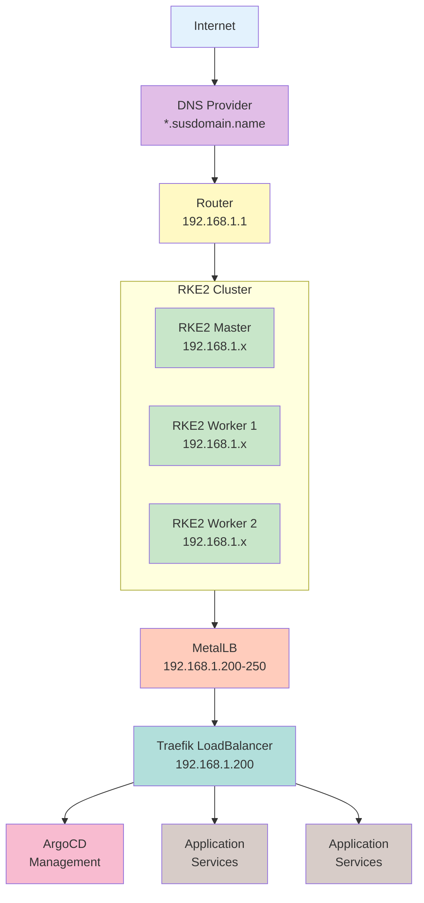
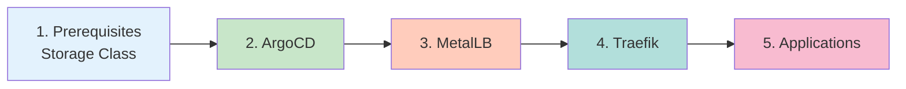
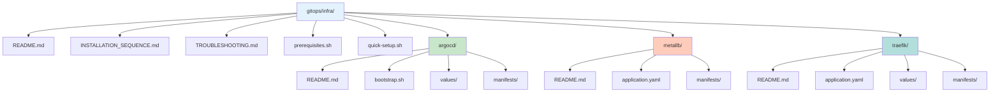

# Homelab Infrastructure Documentation

## Overview

This repository contains the GitOps configuration for a complete Kubernetes homelab infrastructure running on RKE2. The setup follows GitOps principles using ArgoCD for continuous delivery.

## Quick Links

- [Installation Sequence](./INSTALLATION_SEQUENCE.md) - **START HERE** - Detailed installation order
- [ArgoCD Documentation](./argocd/README.md) - GitOps continuous delivery
- [MetalLB Documentation](./metallb/README.md) - Bare metal load balancer
- [Traefik Documentation](./traefik/README.md) - Ingress controller with Let's Encrypt
- [Initial Setup Guide](./homelab-setup.md) - Original setup instructions
- [Troubleshooting Guide](./TROUBLESHOOTING.md) - Common issues and solutions

## Architecture



## Components

### 1. ArgoCD (GitOps Engine)
- **Version:** v3.0.11
- **Purpose:** Automated deployment and synchronization from Git
- **Access:** https://argocd.susdomain.name
- [Full Documentation](./argocd/README.md)

### 2. MetalLB (Load Balancer)
- **Version:** v0.15.2
- **Purpose:** Provides LoadBalancer services for bare metal
- **IP Range:** 192.168.1.200-250
- [Full Documentation](./metallb/README.md)

### 3. Traefik (Ingress Controller)
- **Version:** v3.4.3
- **Purpose:** HTTP/HTTPS routing and SSL termination
- **Features:** Automatic Let's Encrypt certificates
- [Full Documentation](./traefik/README.md)

## Prerequisites

Before starting, ensure you have:

1. **RKE2 Cluster**
   - Minimum 3 nodes (1 master, 2 workers)
   - Each node with at least 2 CPU, 4GB RAM
   - Ubuntu 22.04 or similar

2. **Network Requirements**
   - Static IP addresses for nodes
   - IP range for MetalLB (outside DHCP range)
   - Domain name with DNS control

3. **Tools**
   - kubectl configured with cluster access
   - Helm 3.x installed
   - Git client
   - ArgoCD CLI (optional)

## Installation Order (CRITICAL)

⚠️ **The installation sequence is critical for proper functionality!**



See [Installation Sequence Guide](./INSTALLATION_SEQUENCE.md) for detailed step-by-step instructions.

## Quick Start

### 1. Clone Repository
```bash
git clone https://github.com/sprevacomm/homelab2.git
cd homelab2/gitops/infra
```

### 2. Run Prerequisites Script
```bash
# This script will:
# - Check cluster access
# - Install storage class if needed
# - Create namespaces
# - Verify requirements
./prerequisites.sh
```

### 3. Update Configuration

#### MetalLB IP Range
Edit `metallb/manifests/base/ipaddresspool.yaml`:
```yaml
spec:
  addresses:
    - 192.168.1.200-192.168.1.250  # Update to match your network
```

#### Traefik Configuration
Edit `traefik/values/values.yaml`:
```yaml
service:
  annotations:
    metallb.universe.tf/loadBalancerIPs: "192.168.1.200"  # Your chosen IP

additionalArguments:
  - "--certificatesresolvers.letsencrypt.acme.email=admin@susdomain.name"  # Your email
```

#### Domain Names
Update all references to `susdomain.name` with your actual domain:
```bash
find . -type f -name "*.yaml" -exec grep -l "susdomain.name" {} \; | \
  xargs sed -i 's/susdomain.name/yourdomain.com/g'
```

### 4. Commit Changes
```bash
git add -A
git commit -m "Update configuration for my environment"
git push origin main
```

### 5. Install ArgoCD
```bash
cd argocd
./bootstrap.sh
```

### 6. Deploy Infrastructure
```bash
kubectl apply -f manifests/base/app-of-apps.yaml
```

### 7. Configure DNS
After MetalLB assigns the LoadBalancer IP:
```bash
kubectl get svc -n traefik traefik
# Note the EXTERNAL-IP
```
Point `*.yourdomain.com` to your LoadBalancer IP

## Directory Structure



## Common Operations

### Check Component Status
```bash
# All applications
kubectl get applications -n argocd

# Component pods
kubectl get pods -n argocd
kubectl get pods -n metallb-system
kubectl get pods -n traefik

# Services
kubectl get svc --all-namespaces | grep LoadBalancer
```

### Access Dashboards
```bash
# ArgoCD (after DNS setup)
https://argocd.susdomain.name

# Traefik (after DNS setup)
https://traefik.susdomain.name

# Via port-forward (before DNS)
kubectl port-forward svc/argocd-server -n argocd 8080:443
kubectl port-forward deployment/traefik -n traefik 9000:8080
```

### Update Components
```bash
# Via ArgoCD UI
# 1. Navigate to the application
# 2. Click "App Details"
# 3. Update targetRevision
# 4. Sync

# Via CLI
argocd app set <app-name> --revision <new-version>
argocd app sync <app-name>
```

## Maintenance

### Daily Tasks
- Monitor application health in ArgoCD
- Check for failed pods or services
- Review Traefik access logs for errors

### Weekly Tasks
- Review and apply security updates
- Check certificate renewals
- Verify backups are working

### Monthly Tasks
- Review resource usage and scale if needed
- Update component versions
- Audit access logs and permissions

## Security Considerations

1. **Change Default Passwords**
   - ArgoCD admin password
   - Any default application passwords

2. **Network Security**
   - Implement firewall rules
   - Use network policies
   - Limit MetalLB IP range

3. **SSL/TLS**
   - Always use HTTPS
   - Enable HSTS headers
   - Use production Let's Encrypt

4. **Access Control**
   - Configure RBAC properly
   - Use authentication middlewares
   - Implement IP whitelisting for admin interfaces

## Backup and Recovery

### Backup ArgoCD
```bash
# Applications
kubectl get applications -n argocd -o yaml > argocd-apps-backup.yaml

# Configuration
kubectl get configmap -n argocd -o yaml > argocd-config-backup.yaml
kubectl get secret -n argocd -o yaml > argocd-secrets-backup.yaml
```

### Backup Traefik Certificates
```bash
# If persistence is enabled
kubectl exec -n traefik deployment/traefik -- cat /data/acme.json > acme-backup.json
```

### Disaster Recovery
1. Restore RKE2 cluster
2. Re-run ArgoCD bootstrap
3. Apply backed up applications
4. Restore configurations and secrets

## Contributing

1. Fork the repository
2. Create a feature branch
3. Make your changes
4. Test in your environment
5. Submit a pull request

## Support

For issues and questions:
1. Check the [Troubleshooting Guide](./TROUBLESHOOTING.md)
2. Review component documentation
3. Check component logs
4. Open an issue in the repository

## License

This project is licensed under the MIT License. See LICENSE file for details.

## Acknowledgments

- [ArgoCD](https://argoproj.github.io/cd/) - GitOps continuous delivery
- [MetalLB](https://metallb.universe.tf/) - Load balancer for bare metal
- [Traefik](https://traefik.io/) - Modern reverse proxy
- [RKE2](https://docs.rke2.io/) - Security-focused Kubernetes