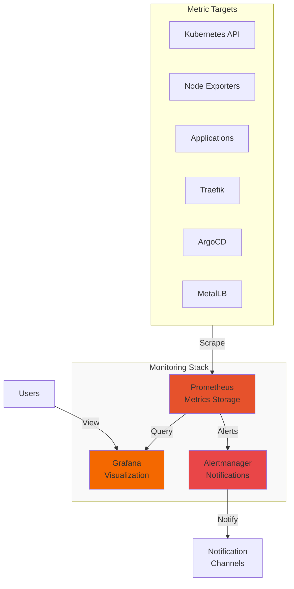

# Monitoring Stack Documentation

## Overview

This monitoring stack provides comprehensive observability for your Kubernetes homelab using the kube-prometheus-stack, which includes:

- **Prometheus** - Metrics collection and storage
- **Grafana** - Visualization and dashboards
- **Alertmanager** - Alert routing and notifications
- **Node Exporter** - Hardware and OS metrics
- **Kube State Metrics** - Kubernetes object metrics
- **Prometheus Operator** - Kubernetes native deployment

**Stack Version:** 75.11.0  
**Prometheus Version:** v0.83.0  
**Grafana Version:** 10.x  
**Alertmanager Version:** 0.27.x

## Architecture



## Components

### Prometheus
- **Purpose:** Time-series metrics database
- **Retention:** 30 days
- **Storage:** 20GB persistent volume
- **Access:** https://prometheus.susdomain.name

### Grafana
- **Purpose:** Metrics visualization and dashboards
- **Storage:** 5GB persistent volume for dashboards
- **Access:** https://grafana.susdomain.name
- **Default Login:** admin/admin (change immediately)

### Alertmanager
- **Purpose:** Alert grouping, routing, and notifications
- **Retention:** 120 hours
- **Storage:** 5GB persistent volume
- **Access:** https://alertmanager.susdomain.name

## Installation

### Prerequisites
- Kubernetes cluster with storage class
- Traefik ingress controller
- ArgoCD for GitOps deployment

### Deployment

1. **Update Configuration**
   ```bash
   # Edit monitoring/values/values.yaml
   # Update domain names from 'susdomain.name' to your domain
   # Update master node IPs for etcd, controller-manager, scheduler
   ```

2. **Apply via ArgoCD**
   ```bash
   # Apply both applications
   kubectl apply -f monitoring/application.yaml
   kubectl apply -f monitoring/manifests-application.yaml
   ```

3. **Verify Deployment**
   ```bash
   # Check pods
   kubectl get pods -n monitoring
   
   # Check persistent volumes
   kubectl get pvc -n monitoring
   ```

## Configuration

### Prometheus Configuration

#### Storage
```yaml
prometheus:
  prometheusSpec:
    retention: 30d
    retentionSize: "10GB"
    storageSpec:
      volumeClaimTemplate:
        spec:
          resources:
            requests:
              storage: 20Gi
```

#### Additional Scrape Targets
Add custom scrape configurations in `values.yaml`:
```yaml
additionalScrapeConfigs:
  - job_name: 'my-app'
    static_configs:
      - targets: ['my-app.default.svc.cluster.local:8080']
```

### Grafana Configuration

#### Admin Password
Change the default admin password:
```bash
kubectl exec -n monitoring deployment/kube-prometheus-stack-grafana -- \
  grafana-cli admin reset-admin-password <new-password>
```

#### Data Sources
Prometheus is automatically configured as the default data source.

#### Importing Dashboards
1. Access Grafana UI
2. Navigate to Dashboards → Import
3. Use these recommended dashboard IDs:
   - **1860** - Node Exporter Full
   - **7249** - Kubernetes Cluster Overview
   - **12114** - Kubernetes Cluster Monitoring
   - **17346** - Traefik Dashboard
   - **14584** - ArgoCD Dashboard

### Alertmanager Configuration

#### Email Notifications
```yaml
alertmanager:
  config:
    receivers:
      - name: 'email-notifications'
        email_configs:
          - to: 'admin@susdomain.name'
            from: 'alertmanager@susdomain.name'
            smarthost: 'smtp.gmail.com:587'
            auth_username: 'your-email@gmail.com'
            auth_password: 'your-app-password'
```

#### Slack Notifications
```yaml
receivers:
  - name: 'slack-notifications'
    slack_configs:
      - api_url: 'YOUR_SLACK_WEBHOOK_URL'
        channel: '#alerts'
        title: 'Homelab Alert'
```

## Usage

### Accessing Dashboards

1. **Grafana**
   - URL: https://grafana.susdomain.name
   - Login: admin/admin (change on first login)
   - Pre-installed dashboards in 'General' folder

2. **Prometheus**
   - URL: https://prometheus.susdomain.name
   - Basic auth: admin/admin (configured in manifests)
   - Query interface for ad-hoc metrics exploration

3. **Alertmanager**
   - URL: https://alertmanager.susdomain.name
   - View active alerts and silences

### Common Queries

#### CPU Usage
```promql
100 - (avg by (instance) (irate(node_cpu_seconds_total{mode="idle"}[5m])) * 100)
```

#### Memory Usage
```promql
(1 - (node_memory_MemAvailable_bytes / node_memory_MemTotal_bytes)) * 100
```

#### Pod Restarts
```promql
increase(kube_pod_container_status_restarts_total[1h])
```

#### Disk Usage
```promql
100 - ((node_filesystem_avail_bytes * 100) / node_filesystem_size_bytes)
```

### Creating Alerts

Example alert for high CPU usage:
```yaml
apiVersion: monitoring.coreos.com/v1
kind: PrometheusRule
metadata:
  name: cpu-alerts
  namespace: monitoring
spec:
  groups:
    - name: cpu
      rules:
        - alert: HighCPUUsage
          expr: 100 - (avg by (instance) (irate(node_cpu_seconds_total{mode="idle"}[5m])) * 100) > 80
          for: 5m
          labels:
            severity: warning
          annotations:
            summary: "High CPU usage on {{ $labels.instance }}"
            description: "CPU usage is above 80% (current value: {{ $value }}%)"
```

## ServiceMonitors

The stack automatically discovers services to monitor using ServiceMonitors:

### Creating a ServiceMonitor
```yaml
apiVersion: monitoring.coreos.com/v1
kind: ServiceMonitor
metadata:
  name: my-app
  namespace: monitoring
spec:
  selector:
    matchLabels:
      app: my-app
  endpoints:
    - port: metrics
      interval: 30s
```

### Pre-configured ServiceMonitors
- Traefik metrics
- ArgoCD components
- MetalLB controller
- Kubernetes components

## Maintenance

### Backup

#### Grafana Dashboards
```bash
# Export all dashboards
kubectl exec -n monitoring deployment/kube-prometheus-stack-grafana -- \
  grafana-cli admin export-dashboard --all > dashboards-backup.json
```

#### Prometheus Data
```bash
# Create snapshot
kubectl exec -n monitoring prometheus-kube-prometheus-stack-prometheus-0 -- \
  curl -XPOST http://localhost:9090/api/v1/admin/tsdb/snapshot

# Copy snapshot
kubectl cp monitoring/prometheus-kube-prometheus-stack-prometheus-0:/prometheus/snapshots \
  ./prometheus-backup
```

### Updates

1. **Update Chart Version**
   ```yaml
   # In application.yaml
   targetRevision: 75.11.0  # Change to new version
   ```

2. **Sync Application**
   ```bash
   argocd app sync kube-prometheus-stack
   ```

### Troubleshooting

#### Prometheus Not Scraping Targets
```bash
# Check service discovery
kubectl port-forward -n monitoring svc/kube-prometheus-stack-prometheus 9090:9090
# Navigate to http://localhost:9090/targets
```

#### Grafana Login Issues
```bash
# Reset admin password
kubectl exec -n monitoring deployment/kube-prometheus-stack-grafana -- \
  grafana-cli admin reset-admin-password admin
```

#### High Memory Usage
```bash
# Check Prometheus memory
kubectl top pods -n monitoring

# Reduce retention if needed
# Edit values.yaml: retention: 15d
```

## Performance Tuning

### Prometheus
```yaml
prometheus:
  prometheusSpec:
    resources:
      requests:
        cpu: 500m
        memory: 512Mi
      limits:
        cpu: 2000m
        memory: 4Gi
```

### Grafana
```yaml
grafana:
  resources:
    requests:
      cpu: 100m
      memory: 128Mi
    limits:
      cpu: 500m
      memory: 512Mi
```

## Security

### Enable Authentication

#### Prometheus Basic Auth
Already configured in `prometheus-ingress.yaml`. Update password:
```bash
htpasswd -nb admin <new-password> | base64
# Update secret in prometheus-ingress.yaml
```

#### Grafana OIDC/OAuth
```yaml
grafana:
  grafana.ini:
    auth.generic_oauth:
      enabled: true
      client_id: grafana
      client_secret: <secret>
      scopes: openid profile email
      auth_url: https://auth.susdomain.name/oauth/authorize
      token_url: https://auth.susdomain.name/oauth/token
```

### Network Policies
```yaml
apiVersion: networking.k8s.io/v1
kind: NetworkPolicy
metadata:
  name: monitoring-ingress
  namespace: monitoring
spec:
  podSelector: {}
  policyTypes:
    - Ingress
  ingress:
    - from:
        - namespaceSelector:
            matchLabels:
              name: traefik
```

## Integration

### Application Metrics

#### Expose Metrics Endpoint
```go
// Go example
import "github.com/prometheus/client_golang/prometheus/promhttp"

http.Handle("/metrics", promhttp.Handler())
```

#### Add ServiceMonitor
```yaml
apiVersion: monitoring.coreos.com/v1
kind: ServiceMonitor
metadata:
  name: my-app
  namespace: default
spec:
  selector:
    matchLabels:
      app: my-app
  endpoints:
    - port: metrics
```

### Custom Dashboards

1. Create dashboard in Grafana UI
2. Export as JSON
3. Add to ConfigMap:
```yaml
apiVersion: v1
kind: ConfigMap
metadata:
  name: my-dashboard
  namespace: monitoring
  labels:
    grafana_dashboard: "1"
data:
  my-dashboard.json: |
    <dashboard-json>
```

## Best Practices

1. **Resource Limits**
   - Set appropriate resource limits
   - Monitor Prometheus memory usage
   - Use retention policies

2. **Alerting**
   - Start with critical alerts only
   - Use appropriate alert thresholds
   - Implement alert routing

3. **Dashboards**
   - Keep dashboards focused
   - Use variables for flexibility
   - Document dashboard purpose

4. **Security**
   - Enable authentication
   - Use HTTPS only
   - Implement RBAC

5. **Maintenance**
   - Regular backups
   - Monitor storage usage
   - Update components regularly

## References

- [Prometheus Documentation](https://prometheus.io/docs/)
- [Grafana Documentation](https://grafana.com/docs/)
- [Alertmanager Documentation](https://prometheus.io/docs/alerting/latest/alertmanager/)
- [kube-prometheus-stack Chart](https://github.com/prometheus-community/helm-charts/tree/main/charts/kube-prometheus-stack)
- [Awesome Prometheus Alerts](https://awesome-prometheus-alerts.grep.to/)