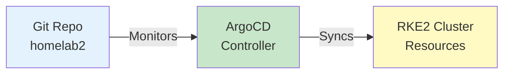

# ArgoCD Documentation

## Overview

ArgoCD is a declarative, GitOps continuous delivery tool for Kubernetes. It monitors Git repositories and automatically syncs the cluster state to match the desired state defined in Git.

**Version:** v8.1.3  
**Chart Version:** 8.1.3  
**Namespace:** `argocd`

## Architecture



### Components

1. **Application Controller** - Monitors applications and compares live state vs desired state
2. **API Server** - gRPC/REST server for the Web UI, CLI, and CI/CD systems
3. **Repository Server** - Internal service that maintains a local cache of Git repositories
4. **Redis** - Caching layer
5. **Dex** - OIDC provider (disabled in this setup)
6. **ApplicationSet Controller** - Automates Application creation

## Installation

### Prerequisites

- Kubernetes cluster (RKE2)
- kubectl configured
- Helm 3.x installed
- Git repository (public or with configured credentials)

### Bootstrap Installation

```bash
# Clone the repository
git clone https://github.com/sprevacomm/homelab2.git
cd homelab2/infrastructure/bootstrap

# Run the bootstrap script
./bootstrap.sh
```

The bootstrap script performs:
1. Adds ArgoCD Helm repository
2. Creates `argocd` namespace
3. Installs ArgoCD via Helm with custom values
4. Waits for pods to be ready

### Manual Installation

```bash
# Add Helm repository
helm repo add argo https://argoproj.github.io/argo-helm
helm repo update

# Create namespace
kubectl create namespace argocd

# Install ArgoCD
helm install argocd argo/argo-cd \
  --namespace argocd \
  --version 8.1.3 \
  --values values/values.yaml
```

## Configuration

### Key Configuration Files

1. **values/values.yaml** - Helm values for ArgoCD installation
2. **manifests/base/app-of-apps.yaml** - Root application that manages other applications
3. **bootstrap.sh** - Installation script

### Important Settings

#### Server Configuration
```yaml
server:
  replicas: 1
  insecure: true  # Internal TLS disabled (TLS termination at ingress)
  ingress:
    enabled: true
    ingressClassName: traefik
    hosts:
      - argocd.susdomain.name
```

#### Repository Configuration
```yaml
configs:
  cm:
    repositories: |
      - type: git
        url: https://github.com/sprevacomm/homelab2.git
        name: homelab2
      - type: helm
        url: https://metallb.github.io/metallb
        name: metallb
      - type: helm
        url: https://helm.traefik.io/traefik
        name: traefik
```

#### RBAC Configuration
```yaml
configs:
  rbac:
    policy.default: role:readonly
    policy.csv: |
      p, role:admin, applications, *, */*, allow
      p, role:admin, clusters, *, *, allow
      p, role:admin, repositories, *, *, allow
      p, role:admin, certificates, *, *, allow
      p, role:admin, projects, *, *, allow
      p, role:admin, accounts, *, *, allow
      p, role:admin, gpgkeys, *, *, allow
      p, role:admin, logs, *, *, allow
      p, role:admin, exec, *, *, allow
      
      g, argocd-admins, role:admin
```

### Default Credentials

- **Username:** admin
- **Password:** admin (bcrypt hash in values.yaml)

⚠️ **IMPORTANT:** Change the default password immediately after installation!

## Usage

### Accessing the UI

1. **Via Ingress (after DNS setup):**
   ```
   https://argocd.susdomain.name
   ```

2. **Via Port Forward (temporary):**
   ```bash
   kubectl port-forward svc/argocd-server -n argocd 8080:443
   # Access at: https://localhost:8080
   ```

### CLI Access

1. **Install ArgoCD CLI:**
   ```bash
   # macOS
   brew install argocd
   
   # Linux
   curl -sSL -o /usr/local/bin/argocd https://github.com/argoproj/argo-cd/releases/latest/download/argocd-linux-amd64
   chmod +x /usr/local/bin/argocd
   ```

2. **Login:**
   ```bash
   argocd login argocd.susdomain.name
   # or with port-forward
   argocd login localhost:8080
   ```

3. **Change admin password:**
   ```bash
   argocd account update-password
   ```

### Managing Applications

#### Create an Application
```bash
# Via CLI
argocd app create my-app \
  --repo https://github.com/sprevacomm/homelab2.git \
  --path apps/my-app \
  --dest-server https://kubernetes.default.svc \
  --dest-namespace default

# Via YAML
kubectl apply -f - <<EOF
apiVersion: argoproj.io/v1alpha1
kind: Application
metadata:
  name: my-app
  namespace: argocd
spec:
  project: default
  source:
    repoURL: https://github.com/sprevacomm/homelab2.git
    targetRevision: main
    path: apps/my-app
  destination:
    server: https://kubernetes.default.svc
    namespace: default
  syncPolicy:
    automated:
      prune: true
      selfHeal: true
EOF
```

#### Sync an Application
```bash
# CLI
argocd app sync my-app

# kubectl
kubectl patch application my-app -n argocd --type merge \
  -p '{"operation": {"initiatedBy": {"username": "admin"}, "sync": {}}}'
```

#### List Applications
```bash
# CLI
argocd app list

# kubectl
kubectl get applications -n argocd
```

## App of Apps Pattern

The infrastructure uses the "App of Apps" pattern where a root application manages other applications:

```yaml
# manifests/base/app-of-apps.yaml
apiVersion: argoproj.io/v1alpha1
kind: Application
metadata:
  name: infrastructure
  namespace: argocd
spec:
  source:
    repoURL: https://github.com/sprevacomm/homelab2.git
    targetRevision: main
    path: gitops/infrastructure
  destination:
    server: https://kubernetes.default.svc
    namespace: argocd
```

This pattern provides:
- Single point of control
- Automatic discovery of new applications
- Simplified bootstrapping

## Maintenance

### Regular Tasks

1. **Monitor Application Health:**
   ```bash
   kubectl get applications -n argocd
   argocd app list
   ```

2. **Check Sync Status:**
   ```bash
   argocd app get <app-name>
   ```

3. **View Application Logs:**
   ```bash
   argocd app logs <app-name>
   ```

### Backup

1. **Export Applications:**
   ```bash
   kubectl get applications -n argocd -o yaml > argocd-apps-backup.yaml
   ```

2. **Export Settings:**
   ```bash
   kubectl get configmap argocd-cm -n argocd -o yaml > argocd-cm-backup.yaml
   kubectl get secret argocd-secret -n argocd -o yaml > argocd-secret-backup.yaml
   ```

### Updates

1. **Update Helm Values:**
   ```bash
   # Edit values/values.yaml
   # Then upgrade
   helm upgrade argocd argo/argo-cd \
     --namespace argocd \
     --version <new-version> \
     --values values/values.yaml
   ```

2. **Update via GitOps:**
   - Modify the `targetRevision` in the application manifest
   - Commit and push changes
   - ArgoCD will auto-sync if configured

### Troubleshooting

#### Application Won't Sync
```bash
# Check application details
kubectl describe application <app-name> -n argocd

# Check events
kubectl get events -n argocd --sort-by='.lastTimestamp'

# Force refresh
argocd app get <app-name> --refresh
```

#### Repository Access Issues
```bash
# Test repository access
argocd repo list

# Add repository credentials
argocd repo add https://github.com/user/repo \
  --username <username> \
  --password <password>
```

#### Performance Issues
```bash
# Check resource usage
kubectl top pods -n argocd

# Increase resources in values.yaml
controller:
  resources:
    requests:
      cpu: 500m
      memory: 512Mi
    limits:
      cpu: 1000m
      memory: 1Gi
```

## Security Best Practices

1. **Change Default Password:**
   ```bash
   argocd account update-password
   ```

2. **Enable RBAC:**
   - Configure appropriate roles in `values.yaml`
   - Map groups to roles for team access

3. **Use HTTPS:**
   - Always access via HTTPS
   - Configure proper TLS certificates

4. **Repository Credentials:**
   - Use SSH keys or GitHub Apps for private repos
   - Store credentials as Kubernetes secrets

5. **Limit Cluster Access:**
   ```yaml
   configs:
     params:
       server.disable.auth: false
       exec.enabled: false  # Disable in production
   ```

## Integration with CI/CD

### GitHub Actions Example
```yaml
name: Deploy to ArgoCD
on:
  push:
    branches: [main]

jobs:
  deploy:
    runs-on: ubuntu-latest
    steps:
      - uses: actions/checkout@v2
      
      - name: Update Application
        run: |
          curl -sSL -o /usr/local/bin/argocd https://github.com/argoproj/argo-cd/releases/latest/download/argocd-linux-amd64
          chmod +x /usr/local/bin/argocd
          
          argocd login ${{ secrets.ARGOCD_SERVER }} \
            --username ${{ secrets.ARGOCD_USERNAME }} \
            --password ${{ secrets.ARGOCD_PASSWORD }}
          
          argocd app sync my-app
          argocd app wait my-app
```

## Monitoring

### Metrics
ArgoCD exposes Prometheus metrics:
- `argocd_app_health_status` - Application health
- `argocd_app_sync_total` - Sync operations count
- `argocd_app_info` - Application information

### Grafana Dashboard
Import dashboard ID: 14584 (ArgoCD official dashboard)

## References

- [Official Documentation](https://argo-cd.readthedocs.io/)
- [Helm Chart](https://github.com/argoproj/argo-helm/tree/main/charts/argo-cd)
- [Best Practices](https://argo-cd.readthedocs.io/en/stable/user-guide/best_practices/)
- [GitOps Guide](https://www.gitops.tech/)